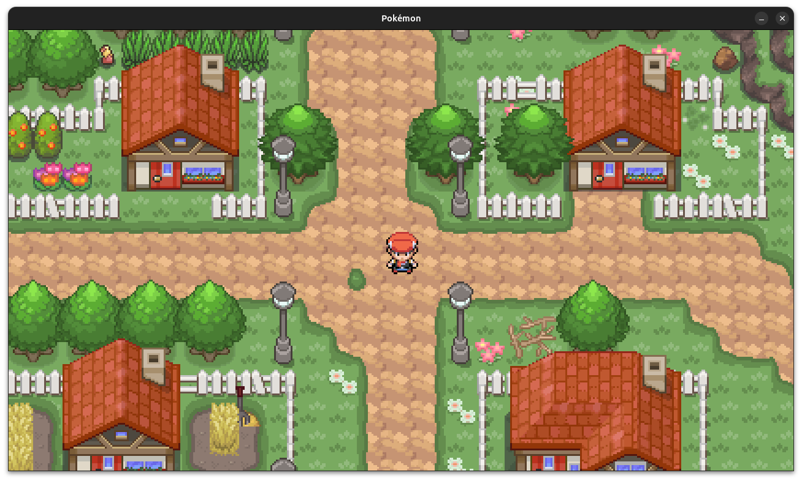
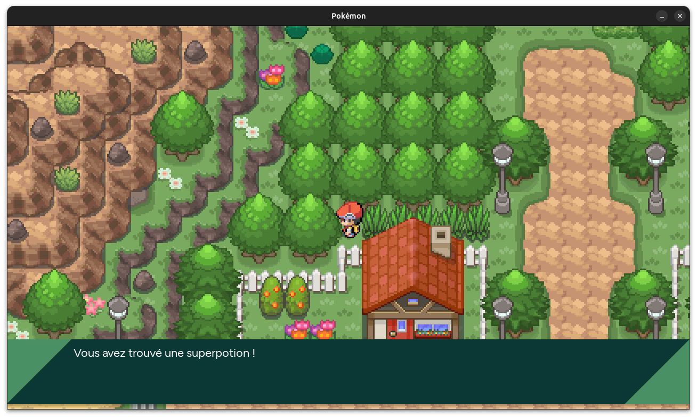

# Pokémon Game ◓ with Python

---
## Table of Contents
- [Description](#description)
- [Installation](#installation)
- [Usage](#usage)
- [Contributing](#contributing)
- [Credits](#credits)
- [License](#license)
- [Questions](#questions)
- [Screenshots](#screenshots)
- [Links](#links)
- [Features](#features)
- [Donations](#donations)

---
## Description

This is a Pokemon fan game made in python using pygame. The game is a 2D top-down game where you can move around the map, interact with objects and NPCs, and battle wild Pokémon. It is still in development and is not yet complete. The game is inspired by the Pokémon Essentials project and aims to recreate the experience of playing a Pokémon game on the PC. It is open-source and anyone can contribute to the project.

## Installation

To install the game, you will need to clone the repository to your computer. You can do this by running the following command in the terminal:
```git clone https://github.com/MrArnaudMichel/Projet_Pokemon.git```

You will also need to install the required dependencies. You can do this by running the following command in the terminal:
```pip install -r requirements.txt```

## Usage

To run the game, you will need to run the main.py file. You can do this by going in the last version of the game and start:
```python main.py```
in the code folder.

## Contributing
If you want to contribute to this project, you can fork the repository and clone it to your computer. You can then make changes and submit a pull request.

## Credits
- [Pokémon SDK](https://pokemonworkshop.com/fr/sdk) for the sprites and the tileset.
- [Flaticon](https://www.flaticon.com/) for the icons.
- [Foret Eternelle](https://www.pokemonforeteternelle.com/) for the graphic inspiration.
- [Poképédia](https://www.pokepedia.fr/) for the data about the Pokémon.
- [Pokestir](https://www.pokestir.com/home) for the music.

## License

This project is licensed under the MIT License - see the [LICENSE](LICENSE) file for details.

## Questions
If you have any questions, you can contact me at the following email address: <a> contact@arnaudmichel.fr</a> or on my [Discord](https://discord.gg/rSXktDNJcA) server.

## Screenshots

|   |   |
|---|---|

## Links
- [Repository](https://github.com/MrArnaudMichel/Projet_Pokemon)
- [Youtube Channel](https://www.youtube.com/channel/UC5-MVwnE8p-8YvdTBkLhYKg)
- [MyGithub](https://github.com/MrArnaudMichel)
- [MyWebsite](https://mrarnaudmichel.github.io)

## Donations
If you want to support me, you can donate with the following link: [PayPal](https://paypal.me/arnaud134)

---
© 2024 Arnaud Michel. All Rights Reserved.
